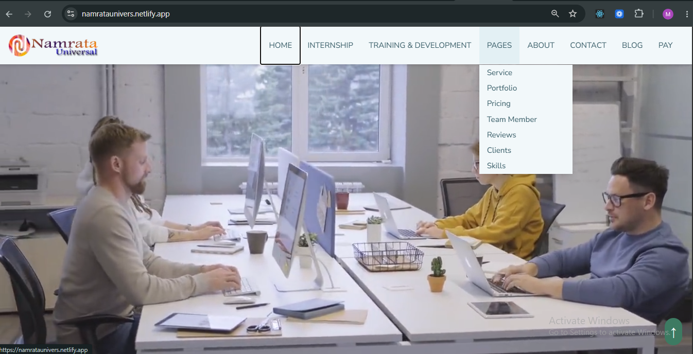
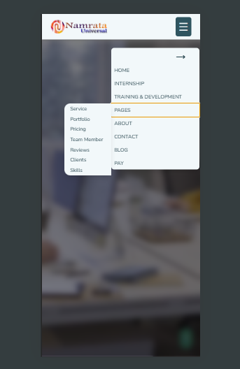
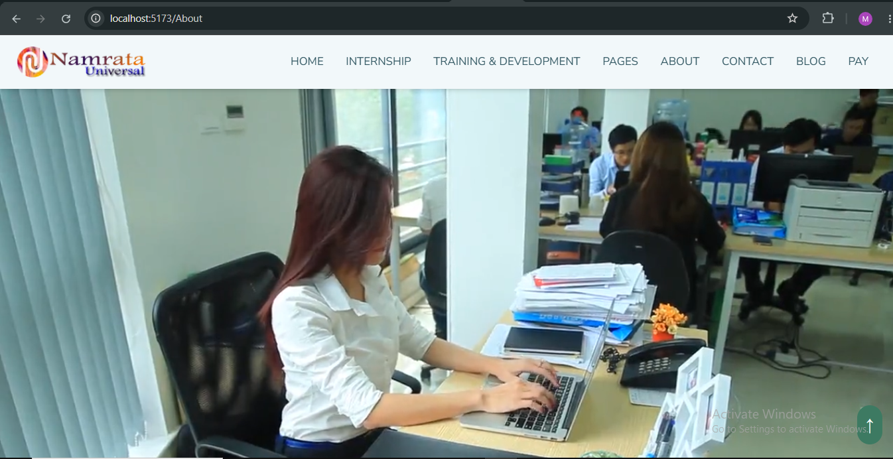
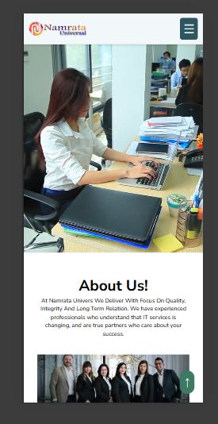
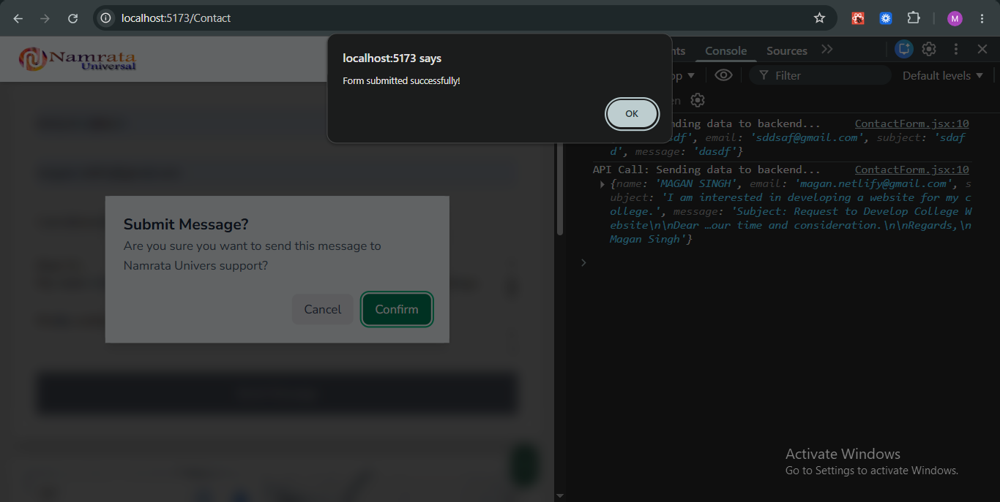
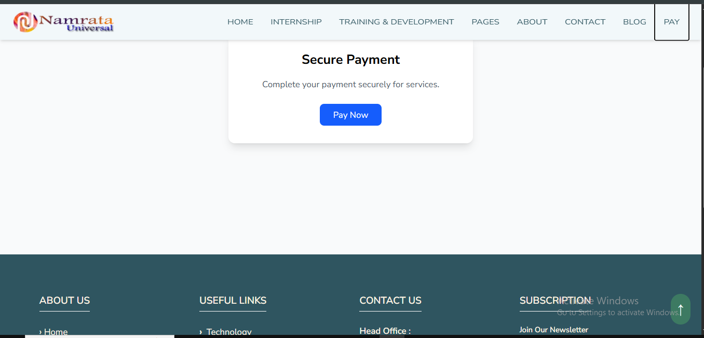
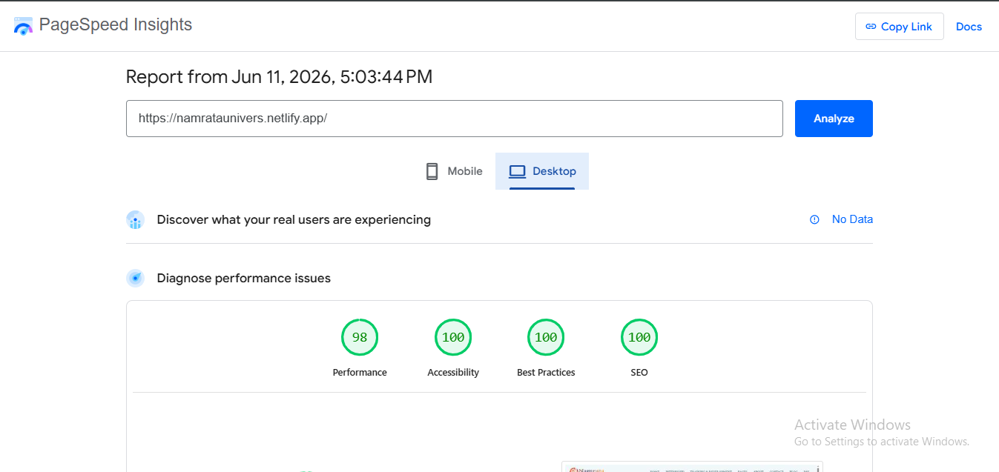
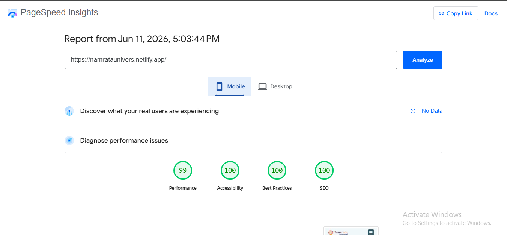
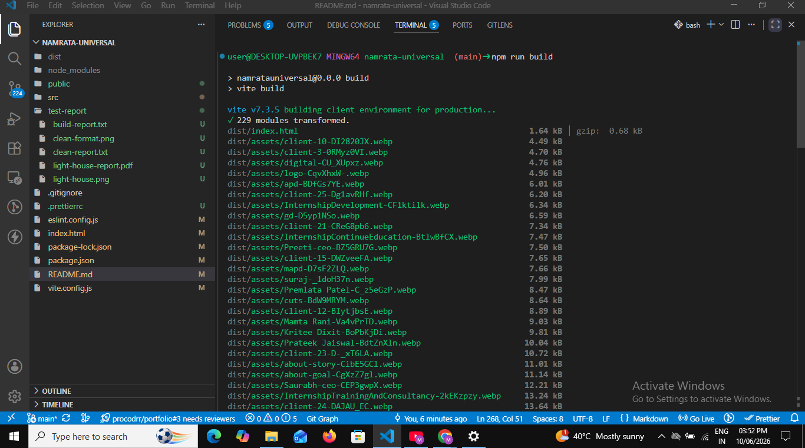

<p align="center">
  
  
  
</p>

# Namrata Univers Business Website

A modern and responsive business website inspired by **Namrata Universal**, built with **React**, **Vite**, and **Tailwind CSS**. The project showcases reusable component architecture, responsive design, performance optimization, accessibility, and SEO best practices.

<p align="center">
  
  
  
  
</p>

---

## 🚀 Project Highlights

- Pixel-perfect responsive UI
- Mobile-first architecture
- Reusable React components
- SEO-friendly structure
- Lighthouse optimized
- Smooth animations
- Performance focused

---

## 🔗 Important Links

- 🌐 Live Demo: https://namrataunivers.netlify.app/
- 💻 Repository: https://github.com/theprocoderx/namrata-univers
- 👨‍💻 Portfolio: https://procoderx.com
- 🐙 GitHub: https://github.com/theprocoderx
- 💼 LinkedIn: https://linkedin.com/in/procoderx
- 📧 Email: procoderxs@gmail.com

---

## 📸 Application Screenshots

### Home Page (Desktop)




### About Page (Desktop & Mobile Layout)




### Form Submit Confirmation Page



### Payment Page



---

## 📌 Features

- **Responsive Layout:** Built with Tailwind CSS Grid and Flexbox for seamless responsiveness across all screen sizes.
- **Client-Side Routing:** Smooth page navigation powered by `react-router-dom`.
- **Scroll Animations:** Interactive scroll-based animations implemented using AOS (Animate On Scroll).
- **Interactive Carousel:** Touch-friendly and responsive sliders powered by Swiper.js.
- **Loading Indicator:** Global loading progress bar for improved navigation feedback.
- **Optimized Assets:** Compressed WebP images and optimized MP4 videos for faster loading and better performance.

---

## 🎯 Key Learning Outcomes

- Built reusable and modular React components for scalable application development.
- Implemented a mobile-first responsive layout using Tailwind CSS utility classes.
- Optimized routing, assets, and overall frontend performance.
- Integrated `react-helmet-async` to improve SEO and metadata management.
- Strengthened understanding of Core Web Vitals and Lighthouse performance optimization.

---

## 📊 Quality Assurance & Performance Reports

This project follows modern frontend development standards with a strong focus on performance, accessibility, SEO, and code quality. Performance metrics and production builds have been thoroughly tested and validated to ensure a fast, reliable, and consistent user experience.

> All performance metrics were measured on the production build using Google Lighthouse under standard throttling conditions.

### 💨 Google PageSpeed Insights (Lighthouse Metrics)

The production distribution hosted on Netlify achieves near-perfect execution scores across both Desktop and Mobile environments.

#### 💻 Desktop Performance Report

- **Performance:** 98/100
- **First Contentful Paint (FCP):** 0.3 s
- **Largest Contentful Paint (LCP):** 0.4 s
- **Total Blocking Time (TBT):** 0 ms
- **Cumulative Layout Shift (CLS):** 0

<p align="center">
  
</p>

#### 📱 Mobile Performance Report

- **Performance:** 98/100
- **First Contentful Paint (FCP):** 1.2 s
- **Largest Contentful Paint (LCP):** 1.5 s
- **Total Blocking Time (TBT):** 0 ms
- **Cumulative Layout Shift (CLS):** 0

<p align="center">
  
</p>

#### 📄 Verifiable PDF Audit Report

- 📥 **Lighthouse Logs:** [Download Combined Desktop & Mobile Metrics Report (PDF)](./reports/lighthouse-report.pdf)

---

### 📦 Production Build Report

The project was successfully built for production using Vite. The build completed without compilation errors or warnings, confirming that the application is production-ready.

- 📄 **Build Log:** [View Complete Build Report](./reports/build-report.txt)

<p align="center">
  
</p>

---

### 🧹 Code Quality Report

The project follows consistent coding standards using ESLint and Prettier to maintain clean, readable, and well-formatted source code.

- 📄 **Code Quality Report:** [View Complete ESLint & Prettier Report](./reports/clean-report.txt)

<p align="center">
  
</p>

---

## 🧰 Tech Stack

### Core Technologies

- 
- 
- 
- 
- 
- 
- 

### UI Libraries

- 
- 
- 

### SEO & Performance

- 
- 

### Development Tools

- 
- 
- 
- 
- 
- 
- 
- 

---

## 📁 Project Structure

```bash
namrata-univers/
│
├── public/
│
├── reports/                 # Quality Assurance & Audit Reports (PDFs, Images & Logs)
│   ├── PageSpeed_Insights.pdf
│   ├── clean-report.txt
│   ├── clean-preview.png
│   ├── build-report.txt
│   ├── build-preview.png
│   ├── lighthouse-desktop.png
│   └── lighthouse-mobile.png
│
├── src/
│   ├── assets/
│   │   ├── icons/
│   │   ├── images/
│   │   └── video/
│   │
│   ├── components/          # Reusable presentation layouts
│   ├── context/             # Global state definitions
│   ├── data/                # Static object configurations
│   ├── hooks/               # Custom hook controllers
│   ├── layouts/             # Page structural boilerplate
│   ├── pages/               # Routed target templates
│   │
│   ├── App.jsx
│   ├── index.css
│   └── main.jsx
│
├── eslint.config.js
├── index.html
├── package.json
├── tailwind.config.js
└── vite.config.js
```

---

## ⚙️ Installation & Setup (Bash Terminal)

Run the following commands sequentially in your local environment shell:

```bash
# 1. Clone the repository
git clone https://github.com/theprocoderx/namrata-univers.git

# 2. Open the project folder
cd namrata-univers

# 3. Install required packages
npm install

# 4. Start the local development server
npm run dev

```

---

## 🛠️ Project Build & Tools Commands

Inside the project directory, you can also run these standard scripts:

- `npm run build` — Compiles down the code and creates a production-ready bundle.
- `npm run preview` — Locally starts the production build to test it before deploying.
- `npm run lint` — Checks the code for any formatting issues or syntax errors.
- `npm run lint:fix` — Automatically fixes basic formatting and styling errors.

## 👨‍💻 Author

Magan Singh  
Frontend Developer | React Developer

Frontend Developer Intern at Namrata Universal (Nov 2025 – Present)

## 📄 License

This project is created for educational and portfolio purposes only. It is not intended for commercial use or redistribution.

All rights reserved to the author.
