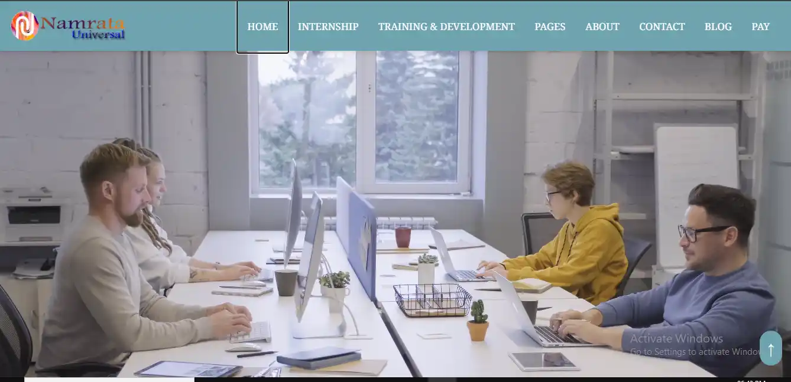
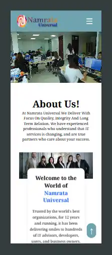
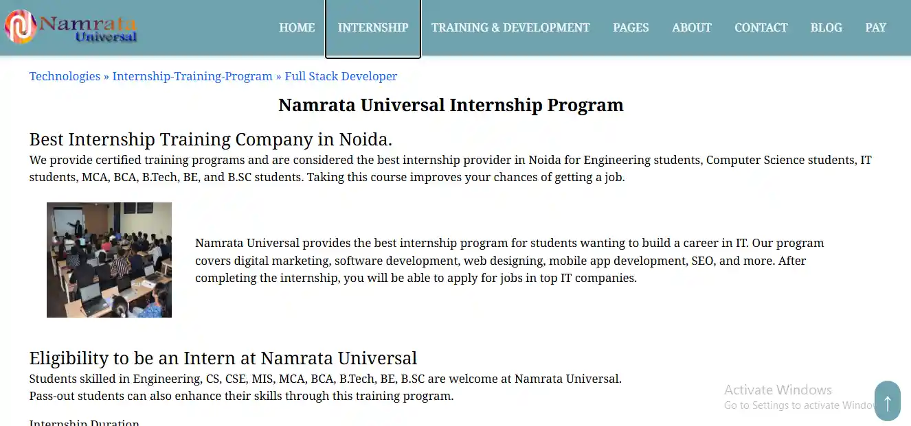
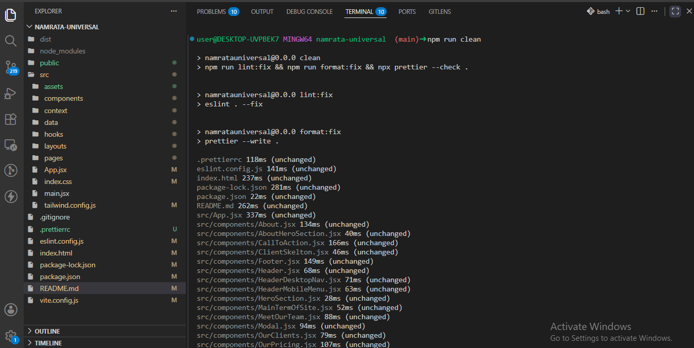
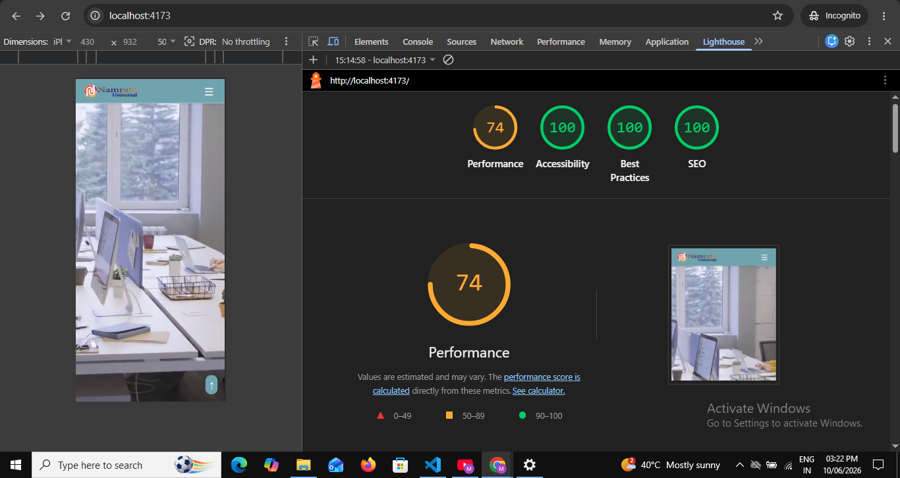

<p align="center">
  
  
  
</p>

# Namrata Universal Clone

A modern and fully responsive business website clone inspired by Namrata Universal, built using React, Vite, and Tailwind CSS. This project focuses on clean UI design, reusable component architecture, smooth animations, responsive layouts, and frontend performance optimization.

---

## ⚡ Highlights

- Pixel-perfect UI cloning
- Mobile-first responsive design
- Optimized Lighthouse performance
- Modular and reusable components
- SEO-friendly React structure

---

## 🔗 Important Links

🔗 Live Website: https://namrataunivers.netlify.app/
💻 GitHub Profile: https://github.com/maganstackforge  
📂 Project Repository: https://github.com/maganstackforge/namrata-universalgit remote -v  
👤 LinkedIn: https://linkedin.com/in/maganstackforge  
📧 Email: magan.stackforge@gmail.com

---

## 📸 Screenshots

### Home Page



### About Page


### About Mobile Page



### Internship Page



---

## 📌 Features

- Fully Responsive Design
- Modern UI/UX
- React Router Navigation
- Smooth Scroll Animations using AOS
- Swiper Sliders & Carousels
- Loading Progress Bar
- Reusable React Components
- Optimized Image Handling
- SEO Friendly Structure
- Fast Build with Vite

---

## 🎯 Key Learning Outcomes

- Built reusable React component architecture
- Implemented responsive layouts using Tailwind CSS
- Practiced route-based code organization
- Improved SEO using React Helmet
- Optimized frontend performance and asset loading

---

## 🧰 Tech Stack

### Frontend

- 

- 
- 
- 
- 
- 
- 

---

### Animation & UI

- 
- 
- 

---

### SEO & Optimization

- 
- 

---

### Tools & Deployment

#### Version Control & Dev Tools

- 
- 

---

#### Development Environment

- 
- 

---

#### Deployment

- 
- 

---

#### Code Quality

- 
- 
- 

---

## 📁 Project Structure

```bash
NAMRATA_UNIVERSAL/
│
├── public/
│
├── src/
│   ├── assets/
│   │   ├── icons/
│   │   ├── images/
│   │   └── video/
│   │
│   ├── components/
│   ├── context/
│   ├── data/
│   ├── hooks/
│   ├── layouts/
│   ├── pages/
│   │
│   ├── App.jsx
│   ├── index.css
│   └── main.jsx
│
├── .gitignore
├── .prettierrc.json
├── eslint.config.js
├── index.html
├── package.json
├── package-lock.json
├── tailwind.config.js
├── vite.config.js
└── README.md
```

---

## ⚙️ Installation & Setup

### 1️⃣ Clone the Repository

```bash
git clone https://github.com/maganstackforge/namrata-universal.git
```

### 2️⃣ Navigate to Project Folder

```bash
cd namrata-universal.clone
```

### 3️⃣ Install Dependencies

```bash
npm install
```

### 4️⃣ Start Development Server

```bash
npm run dev
```

---

## 📦 Production Commands

### Build for Production

```bash
npm run build
```

### Preview Production Build

```bash
npm run preview
```

---

## 🧹 Linting

### Check Lint Errors

```bash
npm run lint
```

### Auto Fix Lint Errors

```bash
npm run lint:fix
```

---

🎨 Libraries & Packages

        | Package               | Purpose               |
        | --------------------- | --------------------- |
        | react-router-dom      | Routing               |
        | swiper                | Sliders & carousels   |
        | aos                   | Scroll animations     |
        | lucide-react          | Icons                 |
        | react-icons           | Icon library          |
        | react-top-loading-bar | Top loading indicator |
        | tailwindcss           | Utility-first CSS     |
        | vite                  | Fast bundler          |

---

## 📱 Responsive Design

This website is optimized for:

- Mobile Devices
- Tablets
- Laptops
- Desktop Screens

---

## ⚡ Performance Optimizations

- Optimized WebP images
- Compressed MP4 videos
- Lazy asset loading
- Responsive layouts
- Reusable component architecture
- Fast bundling with Vite
- Optimized media rendering

---

## 📊 Performance, Build & Code Quality Reports

---

### 🧹 Code Quality Checks (ESLint + Prettier Format)

📄 Full Report: [View Complete TXT Report](./test-report/clean-report.txt)

#### Code Quality Preview



---

### 👀 Production Build and Preview (Vite Preview)

📄 Full Report: [View Complete TXT Report](./test-report/build-report.txt)

#### Build Preview


---

### 📊 Lighthouse Audit

📄 Full Report: [View Complete TXT Report](./test-report/lighthouse-report.pdf)

#### Lighthouse Preview



---

## 👨‍💻 Author

**Magan Singh**  
Frontend Developer | React Developer

---

## 📄 License

This project is created for educational and portfolio purposes only.
